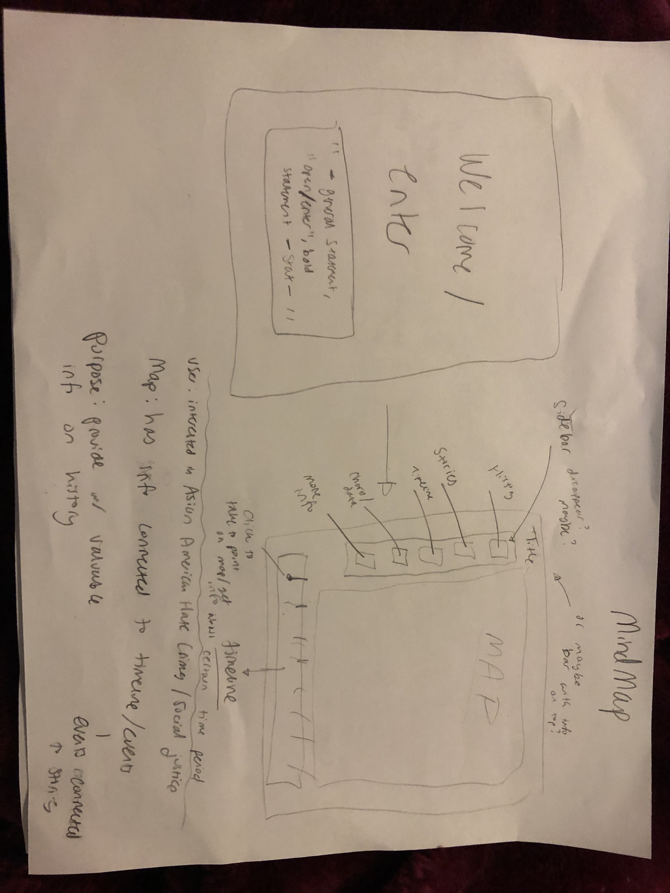

## Fantastic Four's UX Design 
### Mindmaps

<b>Haiqi's Mind Map</b>
  
    
     
Reactions:
- Labiba: Hopefully, we’ll soon acquire the skills to implement a choropleth map with popup graphs!
- Adriana: I like the idea of visualizing potential factors that influenced an increase in hate crimes towards Asian Americans!
- Lynn: Haiqi’s toggle box reminds me of Excel’s Pivot Chart feature, which is a convenient way for a user to customize their experience when navigating the data points on the map/timeline

<b>Labiba's Mind Map</b>
  
    
     
Reactions:
- Haiqi: The idea that clicking on timeline brings users to different parts of the page sounds really nice! I also think it is nice to figure out a visual theme for the web page and the gradient background sounds really cool! My concern would be that some topics that we touch on might be heavy, so we might want to avoid using bright colors.
- Adriana: I like the idea of having images flip over and then have a description!
- Lynn: Labiba thought of cards that could be flipped over with a click to show personal stories of those affected by AsianAm hate crimes, a great way to further engage our users

<b>Adriana's Mind Map</b>
  
    
     
Reactions:
- Haiqi: I love the idea of a welcome page and how the timeline could be interactive with the map!
- Labiba: Buttons would make the user experience much smoother!
- Lynn: Adriana has the idea to present a compelling welcome screen to grab the attention of our user, super cool

<b>Lynn's Mind Map</b>
  
    
     
Reactions:
- Haiqi: Similar to Labiba’s and Adrianna’s idea, Lynn also suggests an interactive timeline, which is definitely something that we can work on!
- Labiba: I like that Lynn was really thinking about the user’s thought process while navigating the website!
- Adriana: I like the idea of a menu bar for navigation purposes and clicking on different points on the timeline to travel across the map!

___

### Crazy Eights

<b>Haiqi's Crazy Eights</b>
  
    
     
Reactions
- Labiba: Hopefully, we’ll soon acquire the skills to implement a choropleth map with popup graphs!
- Adriana: I love the idea of incorporating data that connects to UCLA!
- Lynn: Haiqi introduced a medium we haven’t considered yet—video! Adding videos that are relevant to our data points is another great way to convey our information

<b>Labiba's Crazy Eights</b>
  
    
     
Reactions
- Haiqi:  I love the idea of image flipping! Hopefully that’s something we can do. About music, my concern is similar to the use of color – for certain parts we might want to avoid happy music. 
 - Adriana: The idea of saturation gradients that correlate to different points in history will be a really great visual component on the map!
 - Lynn:  Labiba brought up a great idea to utilize colors to categorize the time periods our data is set in

<b>Adriana's Crazy Eights</b>
  
    
     
Reactions
- Haiqi: I think it would be cool to associate different time periods with different colors and shapes! 
- Labiba: I really like the idea of having buttons to navigate to different parts of the website!
- Lynn: Adriana included the data categorizations into her crazy eights. Having all the data consolidated in a non map-interactive format is very important for accessibility purposes

<b>Lynn's Crazy Eights</b>
  
    
     
Reactions
- Haiqi: This is so cool!! I love the idea of a bar chart popup and I love how you envision our website’s format!
- Labiba: Lynn’s crazy eights were very detailed and I really like the idea of an interactive timeline!
- Adriana: I like how straight forward and easy to navigate all of the pages are. I know I already created the About Us for the storyboard after writing this but I'd love to eventually create something similar to the simple version you created!

### Storyboard (wireframes)

<iframe style="border: 1px solid rgba(0, 0, 0, 0.1);" width="800" height="450" src="https://www.figma.com/embed?embed_host=share&url=https%3A%2F%2Fwww.figma.com%2Ffile%2F10H05OCoEiaMyHV84fwcbY%2FDH-151-Fantastic-Four%3Fnode-id%3D0%253A1" allowfullscreen></iframe>
